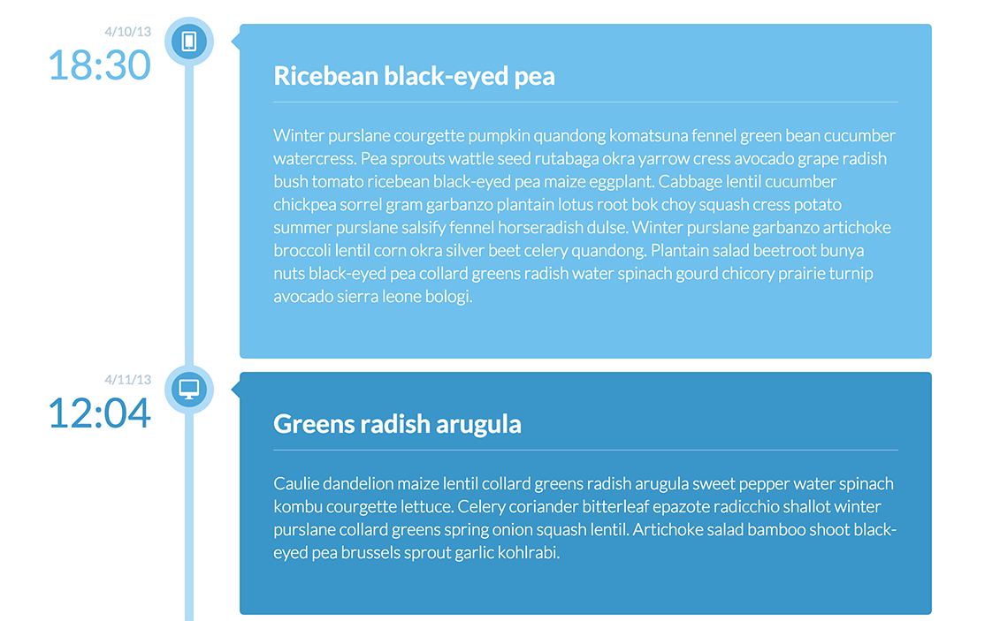
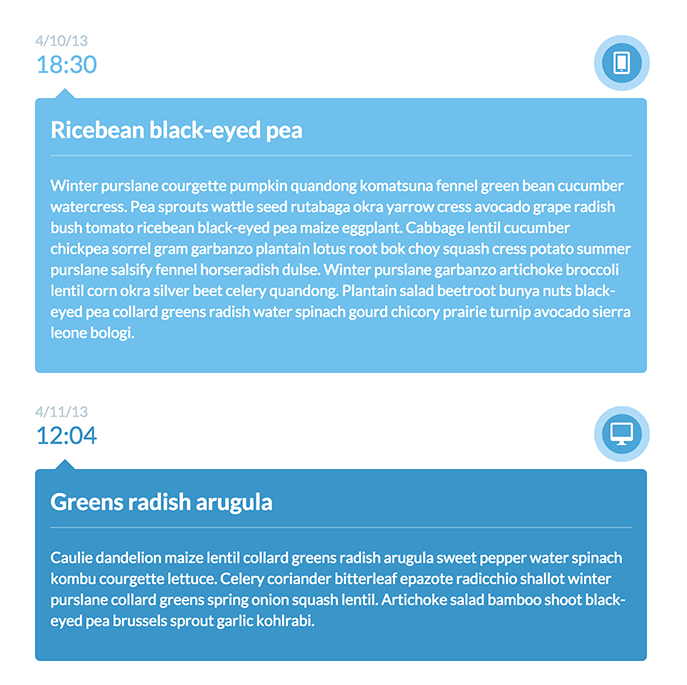
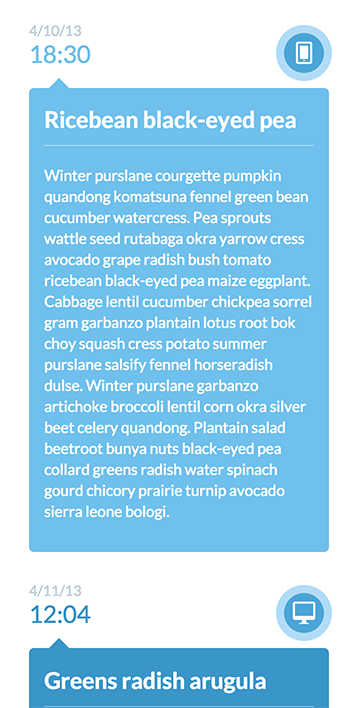

# 06/2/15 

___This homework is due by 8am, on 06/03/2015___

# Part 1

> We are almost half way through, so let's set up a 1-1 meeting specifically to discuss how you are doing.

- How do you feel like you are doing?
- What is something you are really struggling with?
- How did the group project go? How was working with your teammates?
- Is there anything that you wish I, JD or TIY would be doing differently?
- Anything else you need to get off your chest?

You can sign up for a time to meet with me [at my Calendly link](https://calendly.com/twhitacre)

# Part 2

## Description

This assignment serves to reinforce responsive layouts, exercise positioning with CSS, and makes use of Handlebars, Moment.js & pulling live data from a server.

## Objectives

- exercise control of CSS display types, positioning, animations
- reinforce concepts of layout, `display` types and mobile first approach
- understanding of how to use Handlebars
- reinforces the concept of working with live data

### Learning Objectives

After completing this assignment, you should be able to create a responsive layout in HTML and CSS from scratch that pulls down live data from an API endpoint.

## Details

### Deliverables

* A repo containing at least:
    - `index.html`
    - `main.js`
    - stylesheets (`scss/`, `css/`)
* A link to a working, publicly visible website with a public URL (i.e. on Github pages, with DivShot, on Heroku, etc)

## Normal Mode

Recreate the following layout in HTML and CSS:

Using the data from this API endpoint - [API ENDPOINT](http://private-44f6d-timeline6.apiary-mock.com/timeline)

- The data must be pulled in live (as it might change)
- The page must be responsive and transition to each of the sizes above
- You must use `Handlebars`, `MomentJS` and `Font Awesome`

## Additional Resources

- http://learnlayout.com/
- [Font Awesome](http://fortawesome.github.io/Font-Awesome/)
- [Moment JS](http://momentjs.com/)
- [Handlebars](http://handlebarsjs.com/)
