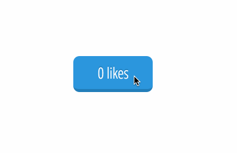

# Build a like button with Angular

## Description
Using an angular controller and directives, build a like button. The button should keep track of how many times it has been clicked and update its count each time it is clicked again.

## Objectives

### Learning Objectives

After completing this assignment, you should…

* Understand how angular `$scope` works within controllers and views.
* Know how to use directives and binding to react to user interactions.

### Performance Objectives

After completing this assignment, you be able to effectively use

* {{ bind }} syntax
* `ng-click`

## Details

### Deliverables

* A repo containing at least:
  * `index.html`
  * `scripts/main.js` -> which should contain a `angular.module()` and `collection`

### Requirements

* No JSHint warnings or errors
* The text on the like button should correctly pluralize its self. For example: 0 likes, 1 like, 2 likes ...

## Normal Mode
Replicate the following behavior using angular.

